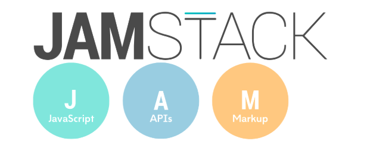
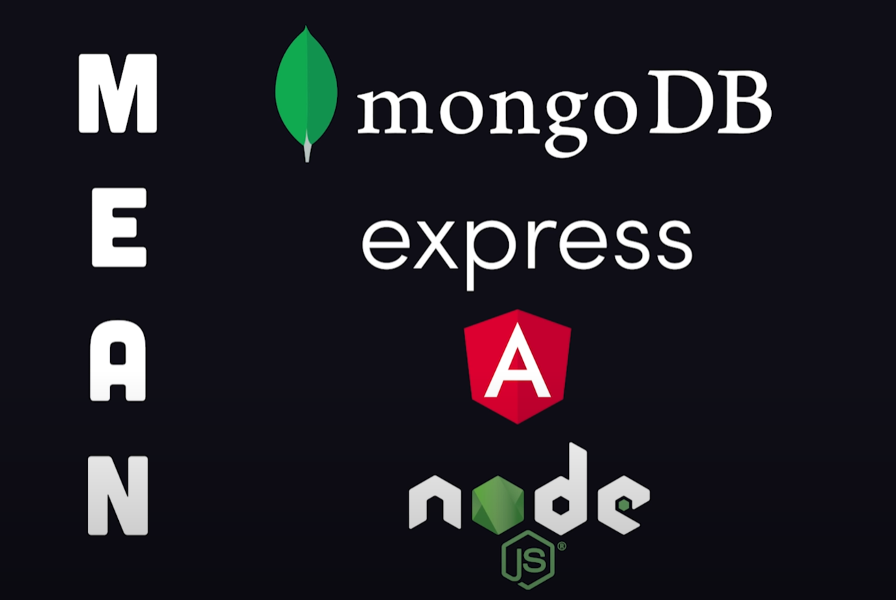
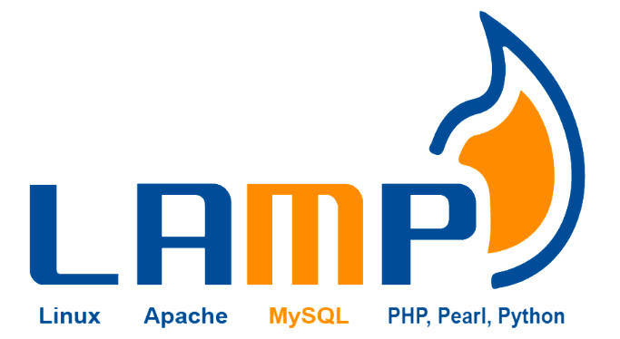

# 技术栈

## JAMStack 技术栈

JAMStack 的 JAM 是 JavaScript、API 和 Markup 的首字母组合。这个技术栈可以说是所有技术栈中最轻量级的，因为它不需要真正与数据库交互，并且主要依赖第三方 API。

我们可以将其定义为基于上述三大技术组件的现代 Web 开发架构。JAMStack 非常适合开发静态网站，因为它几乎没有 DevOps 开销，并且可以由程序员轻松管理。

总而言之，JAMStack 非常适合构建你的第一个博客网站，甚至可以用来创建一些更复杂的网站，其中依赖第三方 SaaS 软件来执行某些更复杂的功能。

MEAN 技术栈的层次包括：

- **JavaScript**
- **API**
- **Markup**

优点：

- 专注于前端构建和交付：JAMStack 更专注于交付和 Web 应用程序的前端。简单来说，这意味着它会尽量限制对数据库后端的调用。图像之类的内容通常已经在 CDN 中，因此可以快速加载到页面里。如果你想要持续不断的交付，这个 Web 技术栈是你的最佳选择。此外，它提供的运行稳定性和对第三方 API 的利用也是很知名的。
- 多个预构建的主题和网站生成器：JAMStack 最大的好处是其提供的各种预构建的网站生成器和主题，你可以从中找到最适合你需求的布局。
- 安全性：它没有数据库，或者至少对数据库的需求有限，这意味着安全问题也是有限的，因为用它开发的网站将依赖静态网页并从 CDN 获取内容，这减少了恶意行为者攻击你网站的可行途径。
- 廉价的托管和维护：JAMStack 的优点众多，其中一条是提供廉价的托管。另外，由于对 DevOps 开发人员的需求减少，你的团队就可以减少技术人员的数量来节省资金，每年可以节约数万甚至数十万美元。
- 即时缓存失效：其即时缓存失效功能使用户可以在发布最新内容时立即查看内容。
- 降低成本：JAMStack 高度依赖第三方系统，因此无需负担昂贵的内部开发人员成本。

缺点：

- 缺乏对较重和动态功能的良好支持：使用 JAMStack 的主要限制之一是它不能很好地处理电子商务购物和登录等更加动态的功能。这是因为这些功能需要数据库才能管理交易。
- 高度依赖第三方系统：高度依赖第三方系统意味着如果这些系统崩溃，那么 JAMStack 也会崩溃。

## MEAN 技术栈

MEAN 是一个开源的、高级的、基于 JavaScript 的技术栈，最适合用于构建动态网站和应用程序。

MEAN 技术栈的层次包括：

- **MongoDB**：一种 NoSQL 数据库，使用带有架构的二进制 JSON 文档。
- **Express.js**：Node.js 的模块化 Web 应用程序框架。
- **AngularJS**：用于构建与业务逻辑分离的客户端界面的应用程序框架。也可以用类似的流行前端框架如 React 或 Vue 替换。
- **Node.js**：一个应用程序运行环境，代表 MEAN 所知名的“JavaScript 无处不在”的范式。

Netflix、Paypal、The Weather Channel 和 Forbes 等公司使用这个技术栈。

优点：

- 所有工具都是开源的，并使用 JavaScript，允许全栈开发。
- 对单页面应用（SPA）有很好的性能。
- 可以在任何操作系统上使用。

缺点：

- 难以适应不使用 JavaScript 的现有架构。
- 在繁重的工作流程中有丢失数据的风险。
- 维护可能是一个麻烦，频繁更新和变化。

## MERN 技术栈

MERN 技术栈是 MEAN 的一个变体，将 Angular 替换为 React。

优点：

- 在最快的时间内构建简单到中等单页应用。
- 优化了 SPAs。
- React 开发者比 Angular 开发者更多。

缺点：

- 没有完整框架可能牺牲一些功能。

## MEVN 技术栈

与 MERN 类似，MEVN 将 Angular 替换为 Vue.js。

优点：

- 比 React 和 Angular 有更快的性能。
- 开箱即用。
- 由于易用性，成本效益高。

缺点：

- 可扩展性不是很大的优势，所以不要计划添加花哨的应用功能。

## LAMP 技术栈

LAMP 是世界上最受欢迎的技术栈，旨在构建不依赖外部软件或数据的应用程序。

LAMP 的层次包括：

- **Linux**：一个开源的、类 Unix 的操作系统，围绕 Linux 内核构建了一个包管理系统。
- **Apache HTTP Server**：一个非常流行且功能齐全的网络服务器，被网络上 54%的网站使用。
- **MySQL**：一个多线程的 SQL 关系数据库管理系统，用于大规模使用。
- **PHP**：一种设计用于 Web 开发的服务器端脚本语言。

优点：

- 栈中每项技术都有广泛的支持。
- 成熟的栈，有许多以前的解决方案和定制可以借鉴。
- 非阻塞结构使其易于扩展，开发更快。
- LAMP 完全开源。
- PHP 和 MySQL 易于学习和使用。

缺点：

- 仅限于 Linux 操作系统。
- 在后端和前端工具之间切换困难。
- 随着 JavaScript 和云的普及，预计使用量将随时间而减少。

## 无服务器（Serverless）

如今，公司从管理自己的应用基础设施转向构建基于云的无服务器应用程序。

优点：

- 非常适合那些负担不起聘请全套团队来管理应用技术栈的小型初创公司。
- 对小型企业和初创公司来说成本效益高。
- 无需管理或维护自己的技术。

缺点：

- 对栈中的技术控制较少。
- 规模扩大后，规模成本会使这种方法变得低效。

## 如何选择？

您将需要考虑：

- 应用程序将是什么类型？基于云、混合等？
- 这个应用程序的预期寿命是多久？
- 我的客户端基础设施中有哪些技术可用？它将是标准化的还是多样化的？
- 您的应用程序需要处理多少流量？流量是突发还是稳定流动？
- 您的应用程序将有多动态？是否会实时更新？
- 您的团队需要进行多少再培训？
- 您想为应用程序分配多少维护？

- 应用程序的预期寿命：JAMStack 的预期寿命最短，主要是因为它依赖于第三方系统，这意味着如果那些第三方系统发生故障，那么整个 Web 应用程序也将发生故障。

- 应用程序类型：每套 Web 技术栈都适合不同类型的 Web 应用程序。对于需要许多功能的更复杂的网站，LAMP 和 MEAN 技术栈表现很出色；诸如博客之类的简单网站可以在轻量级技术栈（如 JAMStack）上开发。

- 预算和维护：如果你们是一家小公司，那么最好的选择是 LAMP，因为它包含上述所有要素，且成本很低。对于资源有限的开发人员来说这是最佳选择。

- 你对每种工具的经验 / 知识积累：归根结底，选择技术栈的重点取决于你最喜欢哪种技术。例如，LAMP 和 MEAN 技术栈提供了许多类似的功能。你熟悉哪种就应该使用哪套技术栈。

作为一般规则，MEAN 更适合小规模的现代应用程序，如渐进式 Web 应用、基于云的应用程序或单页应用。LAMP 更适合优先考虑正常运行时间和可用性的大规模应用程序。
